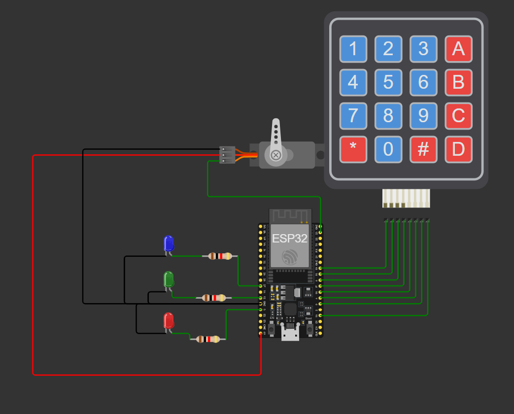
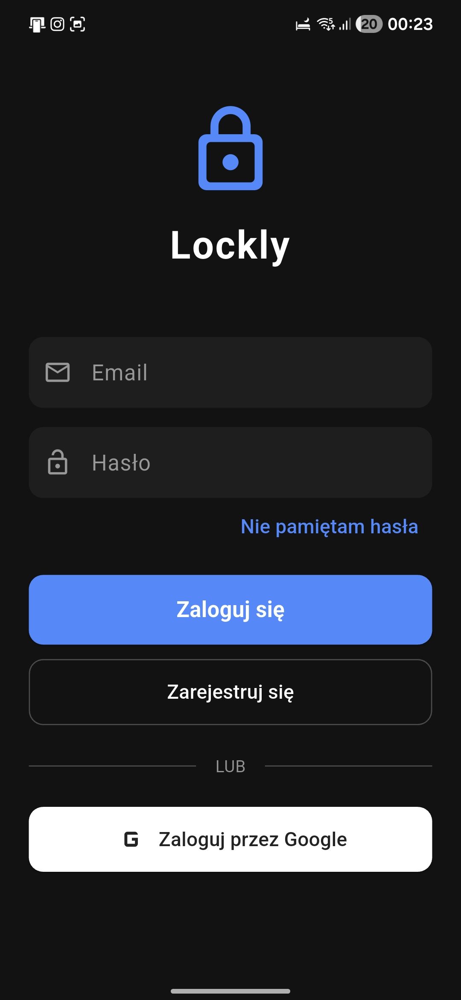

# 🛡️ Lockly App

# Useful docs
* [Flutter](https://flutter.dev)

* [Spring](https://spring.io/projects/spring-boot)

* [Firebase](https://firebase.google.com)

## 📋 About Project

Lockly is a production-grade **IoT mobile application** built with **Flutter**, designed to act as a secure bridge between physical smart locks (**ESP32 microcontrollers**) and cloud infrastructure. The project is architected with ensuring that hardware communication (Bluetooth), backend syncing (Spring Boot), and cloud services (Firebase) remain highly testable and fully decoupled from the UI.

> [!IMPORTANT]
> **Missing Configuration Files:** For security reasons, sensitive files such as `firebase_options.dart`, `google-services.json`, and backend API configurations (`.env` or `local.properties`) are excluded from the repository. You **must** follow the initialization steps below to generate these files before the app can be compiled.

### 🛠️ Core Features & Tech Stack

* **IoT Hardware Integration:** Direct Bluetooth Low Energy (BLE) communication with ESP32 modules.
* **Smart Lock Control:** Open/close mechanisms, dynamically update access PINs, and fetch real-time device statistics directly from the hardware.
* **Dual-Backend Synchronization:** 
  * **Spring Boot API:** Handles core business logic, complex data persistence, and remote locking/blocking functionality over Wi-Fi.
  * **Firebase Ecosystem:** Provides dual-provider Authentication (Google Sign-In & Email/Password) and Firebase Cloud Messaging (FCM) for real-time push alerts.
* **Offline-First Security:** Ensures that local Bluetooth operations (like opening the door via PIN) work seamlessly even if the connection to the Spring/Firebase backend is disrupted.

-----

## 🚀 Setup & Installation

To get the project running on your local machine, follow these technical steps:

### 1\. Dependency Management

Download all necessary Dart and Flutter packages (including BLE and HTTP clients):

```bash
flutter pub get
```

### 2\. Firebase & Backend Environment Setup

Initialize the FlutterFire CLI to bridge the Flutter app with your Firebase project:

```bash
dart pub global activate flutterfire_cli
flutterfire configure
```

*Note: Make sure your `.env` file (if used for Spring Boot API keys) is populated with the correct local/production URLs.*

### 3\. Code Generation

If the project utilizes code generators (e.g., `build_runner` for JSON serialization, Retrofit for API calls, or Dependency Injection):

```bash
flutter pub run build_runner build --delete-conflicting-outputs
```

### 📱 4. Hardware Testing Notice

> [\!WARNING]
> **Physical Device Required:** Because this application relies heavily on Bluetooth (BLE) to communicate with the ESP32, **it cannot be fully tested on iOS simulators or Android emulators**. You must deploy the application to a physical smartphone to test hardware connectivity.

-----

## 🏗️ Quality Assurance Tools

We maintain high enterprise standards for our codebase. Use these commands to keep the project clean:

* **Linter Fixes:** Automatically apply suggested fixes for common code issues.
  ```bash
  dart fix --apply
  ```
* **Static Analysis:** Ensure the code follows the strict rules defined in `analysis_options.yaml`.
  ```bash
  flutter analyze
  ```

# Examples

## WokWi Schema


## App Login Page
